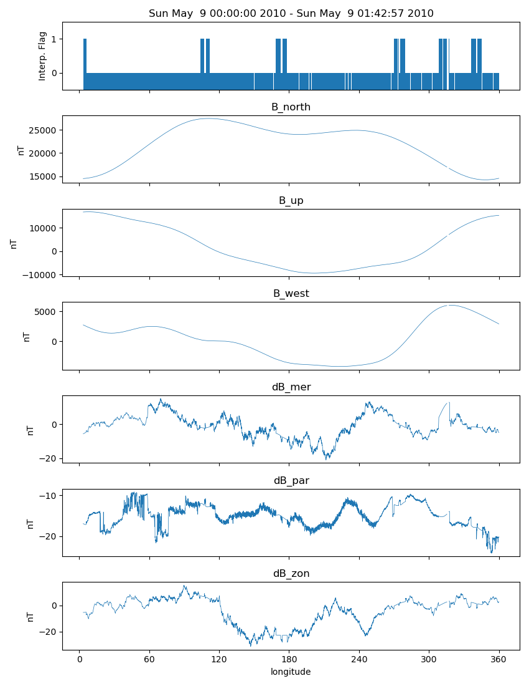

Sample Scientific Analysis
==========================

pysat tends to reduce certain science data investigations to the construction
of a routine(s) that makes that investigation unique, a call to a seasonal
analysis routine, and some plotting commands. Several demonstrations are
offered in this section. The full code for each example is available in the
repository in the demo folder.

Orbit-by-Orbit Plots
--------------------

Plotting a series of orbit-by-orbit plots is a great way to become familiar
with a satellite data set. If the data set doesn't come with orbit information
this can be a challenge. Orbits also go past day breaks. If data comes in daily
files this requires loading multiple files at once, joining the data together,
etc. pysat goes through that trouble for you.

.. code:: python

   import datetime as dt
   import matplotlib.pyplot as plt
   import os
   import pysat

   # set the directory to save plots to
   results_dir = ''

   # select vefi dc magnetometer data, use longitude to determine where
   # there are changes in the orbit (local time info not in file)
   orbit_info = {'index': 'longitude', 'kind': 'longitude'}
   vefi = pysat.Instrument(platform='cnofs', name='vefi', tag='dc_b',
                           clean_level=None, orbit_info=orbit_info)

   # set limits on dates analysis will cover, inclusive
   start = dt.datetime(2010, 5, 9)
   stop = dt.datetime(2010, 5, 12)

   # if there is no vefi dc magnetometer data on your system
   # then run command below
   # where start and stop are pandas datetimes (from above)
   # pysat will automatically register the addition of this
   # data at the end of download
   vefi.download(start, stop)

   # Specify the analysis time limits using `bounds`
   vefi.bounds = (start, stop)
   # if unassigned, code will run for the entire dataset available

   for orbit_count, vefi in enumerate(vefi.orbits):
       # for each loop pysat puts a copy of the next available
       # orbit into   vefi.data
       # changing .data at this level does not alter other orbits
       # reloading the same orbit will erase any changes made

       # satellite data can have time gaps, which leads to plots
       # with erroneous lines connecting measurements on
       # both sides of the gap
       # command below fills in any data gaps using a
       # 1-second cadence with NaNs
       # see pandas documentation for more info
       vefi.data = vefi.data.resample('1S',  fill_method='ffill',
                                      limit=1, label='left')

       f, ax = plt.subplots(7, sharex=True, figsize=(8.5,11))

       ax[0].plot(vefi['longitude'], vefi['B_flag'])
       ax[0].set_title(' '.join((vefi.data.index[0].ctime(),'-',
                                 vefi.data.index[-1].ctime())))
       ax[0].set_ylabel('Interp. Flag')
       ax[0].set_ylim((0, 2))

       p_params = ['B_north', 'B_up', 'B_west',
                   'dB_mer', 'dB_par', 'dB_zon']
       for a, param in zip(ax[1:], p_params):
          a.plot(vefi['longitude'], vefi[param])
          a.set_title(vefi.meta[param].long_name)
          a.set_ylabel(vefi.meta[param].units)

       ax[6].set_xlabel(vefi.meta['longitude'].long_name)
       ax[6].set_xticks([0, 60, 120, 180, 240, 300, 360])
       ax[6].set_xlim((0, 360))

       f.tight_layout()
       fname = 'orbit_{num:05}.png'.format(num=orbit_count)
       plt.savefig(os.path.join(results_dir, fname))
       plt.close()

Sample Output (first orbit only)

