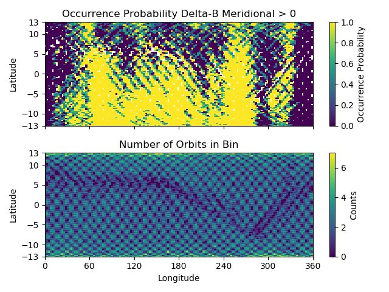
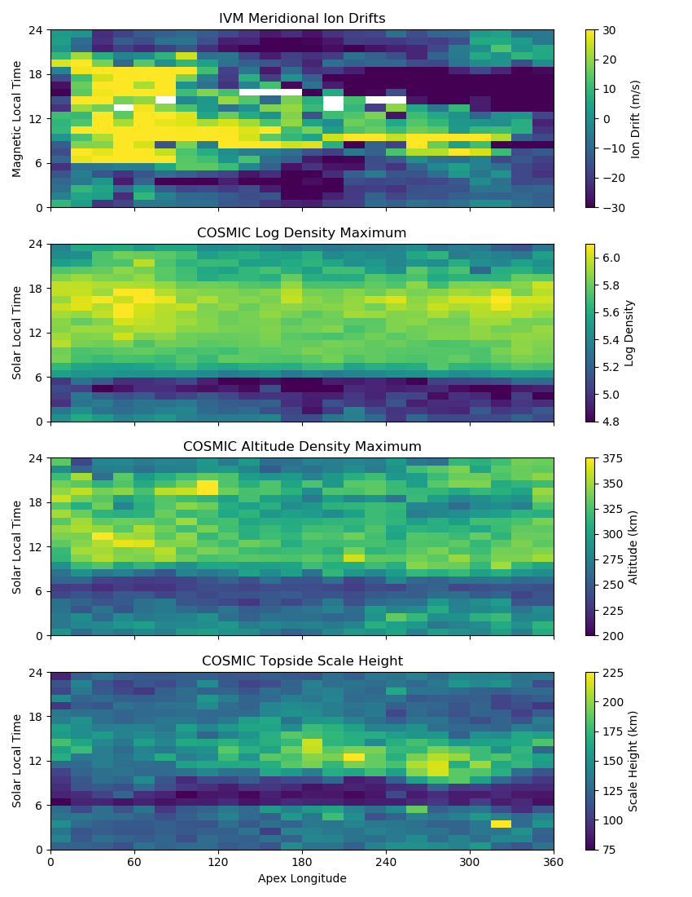
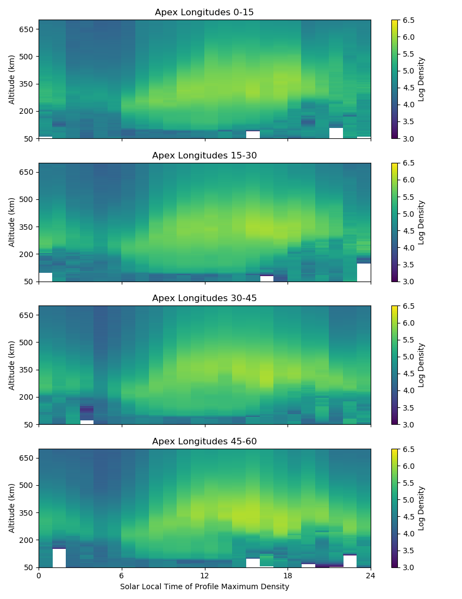

Code Examples
=============

Pysat tends to reduce certain science data investigations to the construction of a routine(s) that makes that investigation unique, a call to a seasonal analysis routine, and some plotting commands. Several demonstrations are offered in this section.

Seasonal Occurrence by Orbit
----------------------------

How often does a particular thing occur on a orbit-by-orbit basis? Let's find out. For VEFI, let us calculate the occurrence of a positive perturbation in the meridional component of the geomagnetic field.

.. code:: python

   import os
   import pysat
   import matplotlib.pyplot as plt
   import pandas as pds
   import numpy as np

   # set the directory to save plots to
   results_dir = ''

   # select vefi dc magnetometer data, use longitude to determine where
   # there are changes in the orbit (local time info not in file)
   orbit_info = {'index':'longitude', 'kind':'longitude'}
   vefi = pysat.Instrument(platform='cnofs', name='vefi', tag='dc_b', 
                           clean_level=None, orbit_info=orbit_info)

   # define function to remove flagged values
   def filter_vefi(inst):
       idx, = np.where(vefi['B_flag']==0)
       vefi.data = vefi.data.iloc[idx]
       return
   # attach function to vefi 
   vefi.custom.add(filter_vefi,'modify')
   # set limits on dates analysis will cover, inclusive
   start = pds.datetime(2010,5,9)
   stop = pds.datetime(2010,5,15)

   # if there is no vefi dc magnetometer data on your system 
   # run command below
   # where start and stop are pandas datetimes (from above)
   # pysat will automatically register the addition of this data at the end    
   # of download
   vefi.download(start, stop)

   # leave bounds unassigned to cover the whole dataset 
   vefi.bounds = (start,stop)

   # perform occurrence probability calculation
   # any data added by custom functions is available within routine below
   ans = pysat.ssnl.occur_prob.by_orbit2D(vefi, [0,360,144], 'longitude', 
                [-13,13,104], 'latitude', ['dB_mer'], [0.], returnBins=True)

   # a dict indexed by data_label is returned
   # in this case, only one, we'll pull it out
   ans = ans['dB_mer']
   # plot occurrence probability
   f, axarr = plt.subplots(2,1, sharex=True, sharey=True)
   masked = np.ma.array(ans['prob'], mask=np.isnan(ans['prob']))                                   
   im=axarr[0].pcolor(ans['bin_x'], ans['bin_y'], masked)
   axarr[0].set_title('Occurrence Probability Delta-B Meridional > 0')
   axarr[0].set_ylabel('Latitude')
   axarr[0].set_yticks((-13,-10,-5,0,5,10,13))
   axarr[0].set_ylim((ans['bin_y'][0],ans['bin_y'][-1]))
   plt.colorbar(im,ax=axarr[0], label='Occurrence Probability')

   im=axarr[1].pcolor(ans['bin_x'], ans['bin_y'],ans['count'])
   axarr[1].set_xlabel('Longitude')  
   axarr[1].set_xticks((0,60,120,180,240,300,360))
   axarr[1].set_xlim((ans['bin_x'][0],ans['bin_x'][-1]))
   axarr[1].set_ylabel('Latitude')
   axarr[1].set_title('Number of Orbits in Bin')

   plt.colorbar(im,ax=axarr[1], label='Counts')
   f.tight_layout()                                 
   plt.show()
   plt.savefig(os.path.join(results_dir,'ssnl_occurrence_by_orbit_demo') )

Result

The top plot shows the occurrence probability of a positive magnetic field perturbation as a function of geographic longitude and latitude. The bottom plot shows the number of times  the satellite was in each bin with data (on per orbit basis). Individual orbit tracks may be seen. The hatched pattern is formed from the satellite traveling North to South and vice-versa. At the latitudinal extremes of the orbit the latitudinal velocity goes through zero providing a greater coverage density. The satellite doesn't return to the same locations on each pass so there is a reduction in counts between orbit tracks. All local times are covered by this plot, overrepresenting the coverage of a single satellite. 

The horizontal blue band that varies in latitude as a function of longitude is the location of the magnetic equator. Torque rod firings that help C/NOFS maintain proper attitude are performed at the magnetic equator. Data during these firings is excluded by the custom function attached to the vefi instrument object.

Orbit-by-Orbit Plots
--------------------

Plotting a series of orbit-by-orbit plots is a great way to become familiar with a data set. If the data set doesn't come with orbit information, this can be a challenge. Orbits also go past day breaks, so if data comes in daily files this requires loading multiple files at once, joining the data together, etc. pysat goes through that trouble for you.

.. code:: python

   import os
   import pysat
   import matplotlib.pyplot as plt
   import pandas as pds

   # set the directory to save plots to
   results_dir = ''

   # select vefi dc magnetometer data, use longitude to determine where
   # there are changes in the orbit (local time info not in file)
   orbit_info = {'index':'longitude', 'kind':'longitude'}
   vefi = pysat.Instrument(platform='cnofs', name='vefi', tag='dc_b', 
                           clean_level=None, orbit_info=orbit_info)

   # set limits on dates analysis will cover, inclusive
   start = pysat.datetime(2010,5,9)
   stop = pysat.datetime(2010,5,12)

   # if there is no vefi dc magnetometer data on your system
   # then run command below
   # where start and stop are pandas datetimes (from above)
   # pysat will automatically register the addition of this data at the end 
   # of download
   vefi.download(start, stop)

   # leave bounds unassigned to cover the whole dataset 
   vefi.bounds = (start,stop)

   for orbit_count, vefi in enumerate(vefi.orbits):
       # for each loop pysat puts a copy of the next available 
       # orbit into   vefi.data
       # changing .data at this level does not alter other orbits
       # reloading the same orbit will erase any changes made
    
       # satellite data can have time gaps, which leads to plots
       # with erroneous lines connecting measurements on 
       # both sides of the gap
       # command below fills in any data gaps using a 
       # 1-second cadence with NaNs
       # see pandas documentation for more info
       vefi.data = vefi.data.resample('1S',  fill_method='ffill', 
                                      limit=1, label='left' )

       f, ax = plt.subplots(7, sharex=True, figsize=(8.5,11))
    
       ax[0].plot(vefi['longitude'], vefi['B_flag'])
       ax[0].set_title( vefi.data.index[0].ctime() +' - ' + 
                        vefi.data.index[-1].ctime() )
       ax[0].set_ylabel('Interp. Flag')
       ax[0].set_ylim((0,2))
    
       p_params = ['B_north', 'B_up', 'B_west', 'dB_mer',
		   'dB_par', 'dB_zon']
       for a,param in zip(ax[1:],p_params):	
          a.plot(vefi['longitude'], vefi[param])
          a.set_title(vefi.meta[param].long_name)
          a.set_ylabel(vefi.meta[param].units)
    
       ax[6].set_xlabel(vefi.meta['longitude'].long_name)
       ax[6].set_xticks([0,60,120,180,240,300,360])
       ax[6].set_xlim((0,360))   
    
       f.tight_layout()
       fname = 'orbit_%05i.png' % orbit_count
       plt.savefig(os.path.join(results_dir, fname) )
       plt.close()

Output

.. image:: ./images/orbit_00000.png
   :align: center

Seasonal Averaging of Ion Drifts and Density Profiles
-----------------------------------------------------

In-situ measurements of the ionosphere by the Ion Velocity Meter onboard C/NOFS provides information on plasma density, composition, ion temperature, and ion drifts. This provides a great deal of information on the ionosphere though this information is limited to the immediate vicinity of the satellite. COSMIC GPS measurements, with some processing, provide information on the vertical electron density distribution in the ionosphere. The vertical motion of ions measured by IVM should be reflected in the vertical plasma densities measured by COSMIC. To look at this relationship over all longitudes and local times, for magnetic latitudes near the geomagnetic equator, use the code below:

Note the same averaging routine is used for both COSMIC and IVM, and that both 1D and 2D data are handled correctly. The routine below has not yet been uploaded to the repo. (Pending)

.. code:: python

   # instantiate IVM Object
   ivm = pysat.Instrument(platform='cnofs',name='ivm',clean_level='clean')
   # restrict meausurements to those near geomagnetic equator
   ivm.custom.add(restrictMLAT, 'modify', maxMLAT=25.)
   # perform seasonal average
   ivm.bounds(startDate, stopDate)
   ivmResults = pysat.ssnl.avg.median2D(ivm, [0,360,24], 'apex_long', 		                      
                     [0,24,24], 'mlt', ['iv_mer'])

   # create CODMIC instrument object
   cosmic = pysat.Instrument(platform='cosmic2013', name='gps',tag='ionprf',
		clean_level='clean', altitude_bin=3)
   # apply custom functions to all data that is loaded through cosmic
   cosmic.custom.add(addApexLong, 'add')
   # select locations near the magnetic equator
   cosmic.custom.add(filterMLAT, 'modify', mlatRange=(0.,10.) )
   # take the log of NmF2 and add to the dataframe
   cosmic.custom.add(addlogNm, 'add')
   # calculates the height above hmF2 to reach Ne < NmF2/e
   cosmic.custom.add(addTopsideScaleHeight, 'add')

   # do an average of multiple COSMIC data products from startDate through stopDate
   # a mixture of 1D and 2D data is averaged
   cosmic.bounds(startDate, stopDate)
   cosmicResults = pysat.ssnl.avg.median2D(cosmic, [0,360,24], 'apex_long', 
	  [0,24,24],'edmaxlct', ['profiles', 'edmaxalt', 'lognm', 'thf2'])

   # the work is done, plot the results

The top image is the median ion drift from the IVM, while the remaining plots are derived from the COSMIC density profiles. COSMIC data does not come with the location of the profiles in magnetic coordinates, so this information is added using the nano-kernel. 

.. code:: python
    
   cosmic.custom.add(addApexLong, 'add')

call runs a routine that adds the needed information. This routine is currently only using a simple titled dipole model.
Similarly, using custom functions, locations away from the magnetic equator are filtered out and a couple new quantities are added. 

There is a strong correspondence between the distribution of downward drifts between noon and midnight and a reduction in the height of the peak ionospheric density around local sunset. There isn't the same strong correspondence with the other parameters but ion density profiles are also affected by production and loss processes, not measured by IVM.
   
The median averaging routine also produced a series a median altitude profiles as a function of longitude and local time. A selection are shown below. 

There is a gradient in the altitude distribution over longitude near sunset. Between 0-15 longitude an upward slope is seen in bottom-side density levels with local time though higher altitudes have a flatter gradient. This is consistent with the upward ion drifts reported by IVM. Between 45-60 the bottom-side ionosphere is flat with local time, while densities at higher altitudes drop steadily. Ion drifts in this sector become downward at night. Downward drifts lower plasma into exponentially higher neutral densities, rapidly neutralizing plasma and producing an effective flat bottom. Thus, the COSMIC profile in this sector is also consistent with the IVM drifts. 

Between 15-30 degrees longitude, ion drifts are upward, but less than the 0-15 sector. Similarly, the density profile in the same sector has a weaker upward gradient with local time than the 0-15 sector.  Between 30-45 longitude, drifts are mixed, then transition into weaker downward drifts than between 45-60 longitude. The corresponding profiles have a flatter bottom-side gradient than sectors with upward drift (0-30), and a flatter top-side gradient than when drifts are more downward (45-60), consistent with the ion drifts.