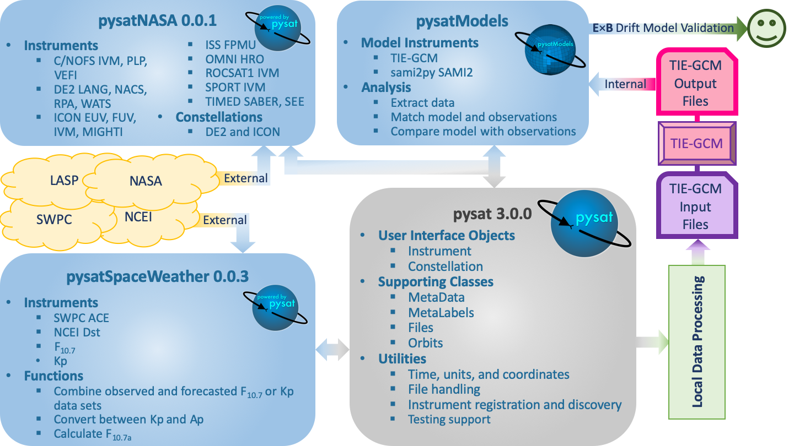
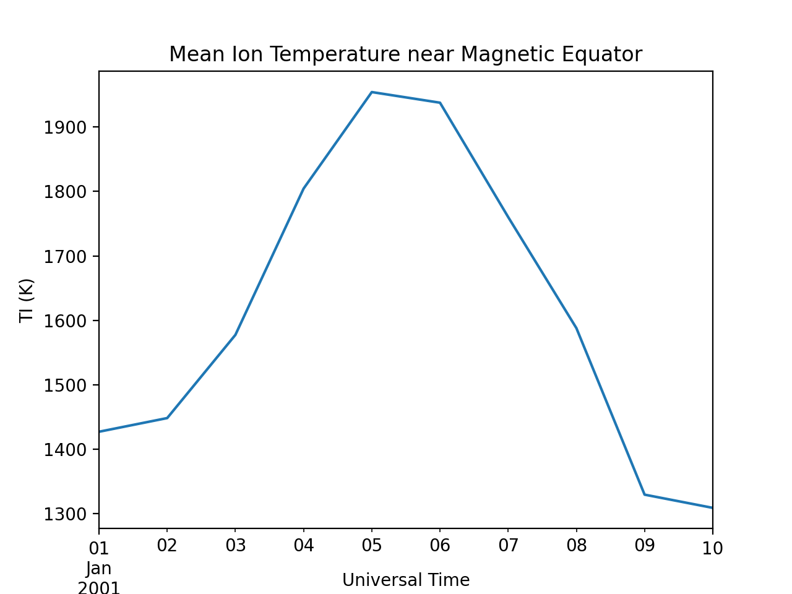

Basics
======

The core functionality of pysat is exposed through the pysat.Instrument object.
The intent of the Instrument object is to offer a single interface for
interacting with science data that is independent of measurement platform.
The layer of abstraction presented by the Instrument object allows for things
to occur in the background that can make science data analysis simpler and more
rigorous.

To begin,

.. code:: python

   import pysat

The data directory paths pysat looks in for data needs to be set
upon the first import,

.. code:: python

   # Set a single directory to store all data
   pysat.params['data_dirs'] = path

   # Alternately, multiple paths may be registered.
   pysat.params['data_dirs'] = [path_1, path_2, ..., path_n]

More than one directory may be assigned by supplying a list of strings.
When looking for data for a given pysat.Instrument, pysat will start with the
first directory and iterate through the list until one is found. Only one
directory with data is supported per Instrument.

If no data is found in any of the listed directories then pysat will by
default assign the first path in ``pysat.params['data_dirs']``.

.. note:: A data directory must be set before any pysat.Instruments may be used
   or an error will be raised.

Instrument Discovery
--------------------

Support for each instrument in pysat is enabled by a suite of methods that
interact with the particular files for that dataset and supply the data within
in a pysat compatible format. A particular data set is identified using
up to four parameters

===============     ===================================
**Identifier** 	        **Description**
---------------     -----------------------------------
  platform		Name of the platform supporting the instrument
  name		        Name of the instrument
  tag		        Label for an instrument data product
  inst_id		Label for instrument sub-group
===============     ===================================

In pysat v3.x+, Instruments are supported by separate instrument packages.
Local instruments in pysat.instruments submodule have been developed for testing
purposes.  The current list and development status of different packages in
the pysat ecosystem can be found on the
`wiki <https://github.com/pysat/pysat/wiki/Pysat-Ecosystem-Status-Chart>`_.

You can learn about the different Instruments in an instrument package using
the utility ``display_available_instruments``.  When providing an Instrument
submodule as input, this will list the Instrument module name, and all possible
combinations of tags, inst_ids, and a description of the data (if available).
This example will use the ``pysatMadrigal`` package.

.. code:: python

    import pysat
    import pysatMadrigal as pysatMad
    pysat.utils.display_available_instruments(pysatMad.instruments)

You can see each listed instrument supports one or more data sets for analysis.
The submodules are named with the convention platform_name.  When supplying
an Instrument submodule as input the display utility provides the submodule
name instead of the platform and name because non-registered Instruments are
instantiated using the ``inst_module`` keyword instead of the ``platform`` and
``name`` keywords (jump to the :ref:`instantiation` section below for more
information).  To use the ``platform`` and ``name`` keywords, the instrument
must be registered. To register a group of instruments within a module,
follow the example below.

.. code:: python

    import pysat
    import pysatMadrigal as pysatMad
    pysat.utils.registry.register_by_module(pysatMad.instruments)

You may also register a more select group of instruments.

.. code:: python

    import pysat
    pysat.utils.registry.register(['pysatMadrigal.instruments.dmsp_ivm',
                                   'pysatMadrigal.instruments.jro_isr'])

See :py:mod:`pysat.utils.registry` for more details. To display the registered
instruments, no input is needed.

.. code:: python

    pysat.utils.display_available_instruments()

Standard Workflow
-----------------

The standard pysat workflow takes place by interacting primarily with pysat and
not the Instrument modules. Exceptions to this rule occur when invoking custom
Instrument analysis methods (typically found in the
``inst_package/instrument/methods/`` directory) or when using specific package
utilites.  The figure below shows a sample workflow, where local routines use
pysatSpaceWeather through pysat to create an input file with appropriate space
weather inputs for TIE-GCM.  Then, the utilities in pysatModels are used within
different local routines to validate the TIE-GCM ionosphere using the C/NOFS IVM
**E** x **B** drifts. This figure also demonstrates how pysat Instruments can
be used to retrieve both external and internal data sets.

Simple Workflow
---------------

A simpler example, that presents a pysat workflow involving retrieving and
loading data from a single Instrument, is presented below.

.. _instantiation:

Instantiation
^^^^^^^^^^^^^

To create a pysat.Instrument object, select a ``platform`` and instrument
``name`` or an ``inst_module`` along side (potentially) a ``tag`` and
``inst_id``, consistent with the desired data from a supported instrument.

For example, if you wanted to work with plasma data from the
Ion Velocity Meter (IVM) onboard the Defense Meteorological
Satellite Program (DMSP) constellation, (specifically, the
F12 spacecraft), use:

.. code:: python

   import pysatMadrigal as pysatMad
   dmsp = pysat.Instrument(inst_module=pysatMad.instruments.dmsp_ivm,
                           tag='utd', inst_id='f12')

Behind the scenes pysat uses a python module named dmsp_ivm that understands
how to interact with 'utd' data for 'f12'.

If you have previously registered the instruments in ``pysatMadrigal``, you
can specify the desired Instrument using the ``platform`` and ``name`` keywords.

.. code:: python

   dmsp = pysat.Instrument(platform='dmsp', name='ivm', tag='utd',
                           inst_id='f12')

You can also specify the specific keyword arguements needed for the standard
``pysat`` methods.  DMSP data is hosted by the `Madrigal database
<http://cedar.openmadrigal.org/openmadrigal/>`_, a community resource for
geospace data. The proper process for downloading DMSP and other Madrigal data
is built into the open source
tool `madrigalWeb <http://cedar.openmadrigal.org/docs/name/rr_python.html>`_,
which is invoked appropriately by ``pysat`` within the
``pysatMadrigal.instruments.dmsp_ivm`` sub-module. Madrigal requires that users
provide their name and email address as their username and password.

.. code:: python

   # Set user and password for Madrigal
   username = 'Firstname+Lastname'
   password = 'email@address.com'

   # Initialize the instrument, passing the username and password to the
   # standard routines that need it
   dmsp = pysat.Instrument(platform='dmsp', name='ivm', tag='utd',
                           inst_id='f12', user=username, password=password)

Download
^^^^^^^^

Let's download some data. To get DMSP data specifically all we have to do is
invoke the ``.download()`` method attached to the DMSP object. If the username
and password have't been provided to the instrument already, be sure to
include them here.

.. code:: python

   import datetime as dt

   # Define date range to download data
   start = dt.datetime(2001, 1, 1)
   stop = dt.datetime(2001, 1, 2)

   # Download data, assuming username and password were not set
   dmsp.download(start, stop, user=username, password=password)

The specific location the data is downloaded to depends upon user settings.
By default, pysat data directories are organized via
top_level/platform/name/tag/inst_id, where the top-level is one of the
directories in ``pysat.params['data_dirs']``. The specific structure for your
system is stored in ``pysat.params['directory_format']``.

Presuming defaults, this example downloads DMSP data to
top_level/dmsp/ivm/utd/f12/. If this is the first download, then the first of
the pysat data directories will be used by default. If there was already DMSP
data on your system under one of the ``pysat.params['data_dirs']``, then the
same top-level directory as existing DMSP data will be used. To pick a
different directory to download data to, use

.. code:: python

   dmsp.files.set_top_level_directory(new_path)

At the end of the download, pysat will update the list of files associated with
DMSP. Note that having multiple directories with data may lead to unexpected
results.

Some instruments support an improved download experience that ensures
the local system is fully up to date compared to the data source. The command,

.. code:: python

    dmsp.download_updated_files()

will obtain the full set of files present on the server and compare the version,
revision, and cycle numbers for the server files with those on the local
system.  Any files missing or out of date on the local system are downloaded
from the server. This command downloads, as needed, the entire dataset.

.. note:: Science data servers may not have the same reliability and
   bandwidth as commercial providers

Load Data
^^^^^^^^^

Data is loaded into a pysat.Instrument object, in this case ``dmsp``, using the
``.load`` method using year, day of year; date; or filename.

.. code:: python

   # Load by year, day of year
   dmsp.load(2001, 1)

   # Load by date
   dmsp.load(date=start)

   # Load by filename from string
   dmsp.load(fname='dms_ut_20010101_12.002.hdf5')

When the pysat load routine runs it stores the instrument data into::

   # Instrument data
   dmsp.data

This configuration provides full access to the underlying data library
functionality. For additional details on loading a range of dates as well as
support for both pandas and xarray as the underlying data structure,
see :ref:`tutorial-load`.

Data Access
^^^^^^^^^^^

After loading data, the next thing you probably want to do is use it!  pysat
supports standard pandas or xarray access through the pysat.data object, but
also provides convenient access to the data at the instrument level that behaves
the same whether the data is pandas or xarray.

.. _DataFrame: https://pandas.pydata.org/pandas-docs/stable/user_guide/dsintro.html

.. _DataSet: http://xarray.pydata.org/en/v0.11.3/generated/xarray.Dataset.html

.. code:: python

    # Convenient data access
    dmsp['ti']

    # Slicing data by indices
    dmsp[0:10, 'ti']

    # Slicing by date and time
    dmsp[start:stop, 'ti']

    # Convenient data assignment
    dmsp['ti'] = new_array

    # Convenient data broadcasting assignment, sets a single value to all times
    dmsp['ti'] = single_value

    # Assignment through index slicing
    dmsp[0:10, 'ti'] = sub_array

    # Assignment through datetime slicing
    dmsp[start:stop, 'ti'] = sub_array

Note, np.where may be used to select a subset of data using either
the convenient access or standard pandas or xarray selection methods.

.. code:: python

   idx, = np.where((dmsp['mlat'] < 5) & (dmsp['mlat'] > -5))
   dmsp.data = dmsp[idx]
   # Alternatively
   dmsp.data = dmsp.data.iloc[idx]

is equivalent to

.. code:: python

   dmsp.data = vefi[(dmsp['mlat'] < 5) & (dmsp['mlat'] > -5)]

See the :ref:`api-instrument` section for more information.

Simple Analysis Example
^^^^^^^^^^^^^^^^^^^^^^^

Here we present an example, following from the simple workflow above, where
we plot DMSP ion temperature data over a season. pysat provides a function,
``pysat.utils.time.create_date_range``, that returns an array of dates
over a season. This time period does not need to be continuous (e.g.,
load both the vernal and autumnal equinoxes).

.. code:: python

    import matplotlib.pyplot as plt
    import numpy as np
    import pandas as pds

    # Create empty series to hold result
    mean_ti = pds.Series()

    # Get list of dates between start and stop
    start = dt.datetime(2001, 1, 1)
    stop = dt.datetime(2001, 1, 10)
    dmsp.download(start=start, stop=stop, user=username, password=password)
    date_array = pysat.utils.time.create_date_range(start, stop)

    # Iterate over season, calculate the mean Ion Temperature
    for date in date_array:
       # Load data into dmsp.data
       dmsp.load(date=date)
       # Check if data present
       if not dmsp.empty:
           # Isolate data to locations near geomagnetic equator
           idx, = np.where((dmsp['mlat'] < 5) & (dmsp['mlat'] > -5))

           # Downselect data
           dmsp.data = dmsp[idx]

           # Compute mean ion temperature using pandas functions and store
           mean_ti[dmsp.date] = dmsp['ti'].abs().mean(skipna=True)

    # Plot the result using pandas functionality for a simple figure
    mean_ti.plot(title='Mean Ion Temperature near Magnetic Equator')

    # Improve figure using matplotlib tools
    plt.ylabel(dmsp.meta['ti', dmsp.meta.labels.name] + ' (' +
               dmsp.meta['ti', dmsp.meta.labels.units] + ')')
    plt.xlabel("Universal Time", labelpad=-15)

Metadata
^^^^^^^^

The example aboved used metadata to provide the y-axis label name and units.
Metadata is also stored in a :ref:`api-meta` object from the main science data.
pysat presumes a minimum default set of metadata that may be arbitrarily
expanded. The default parameters are driven by the attributes required by
public science data files, like those produced by the Ionospheric Connections
Explorer `(ICON) <http://icon.ssl.berkeley.edu>`_.

===============     ===================================
**Metadata** 	        **Description**
---------------     -----------------------------------
  axis              Label for plot axes
  desc              Description of variable
  fill              Fill value for bad data points
  label             Label used for plots
  name              Name of variable, or long_name
  notes             Notes about variable
  max               Maximum valid value
  min               Minimum valid value
  scale             Axis scale, linear or log
  units             Variable units
===============     ===================================

.. code:: python

   # Display all metadata
   dmsp.meta.data

   # Display ion temperature metadata
   dmsp.meta['ti']

   # Retrieve units using standard labels
   dmsp.meta['ti'].units

   # Retrieve units using general labels
   dmsp.meta['ti', dmsp.meta.labels.units]

   # Update units for ion temperature
   dmsp.meta['ti'] = {dmsp.meta.labels.units: 'Kelvin'}

   # Update display name for ion temperature, using LaTeX notation
   dmsp.meta['ti'] = {dmsp.meta.labels.name: 'T$_i$'}

   # Add new meta data
   dmsp.meta['new'] = {dmsp.meta.labels.units: 'unitless',
                       dmsp.meta.labels.name: 'New display name'}

The string values used within metadata to identify the parameters above
are all attached to the instrument object through a label assigned by the
:ref:`api-metalabels` class.  They can be acceess as dmsp.meta.labels.*, or
``dmsp.units_label``, ``dmsp.min_label``, and ``dmsp.notes_label``, etc.

All variables must have the same metadata parameters. If a new parameter
is added for only one data variable, then the remaining data variables will get
a null value for that metadata parameter.

Data may be assigned to the instrument, with or without metadata.

.. code:: python

   # Assign data alone
   dmsp['new_data'] = new_data

   # Assign data with metadata.
   # The data must be keyed under 'data' and all other
   # dictionary inputs are presumed to be metadata
   dmsp['new_data'] = {'data': new_data,
                       dmsp.meta.labels.units: new_unit,
                       'new_meta_data': new_value}

   # Alter assigned metadata
   dmsp.meta['new_data', 'new_meta_data'] = even_newer_value

The labels used for identifying metadata may be provided by the user at
Instrument instantiation and do not need to conform with what is in the file::

   dmsp = pysat.Instrument(platform='dmsp', name='ivm', tag='utd',
                           inst_id='f12', clean_level='dirty',
			   labels={'units': 'new_units'})
   dmsp.load(2001, 1)
   dmsp.meta['ti', 'new_units']
   dmsp.meta['ti', dmsp.meta.labels.units]

While this feature doesn't require explicit support on the part of an instrument
module developer, code that does not use the metadata labels may not always
work when a user invokes this functionality.

pysat's metadata object is case insensitive but case preserving. Thus, if
a particular Instrument uses 'units' for units metadata, but a separate
package that operates via pysat but uses 'Units' or even 'UNITS', the code
will still function::

   # the following are all equivalent
   dmsp.meta['TI', 'Long_Name']
   dmsp.meta['Ti', 'long_Name']
   dmsp.meta['ti', 'Long_NAME']

.. note:: While metadata access is case-insensitive, data access is case-sensitive.
